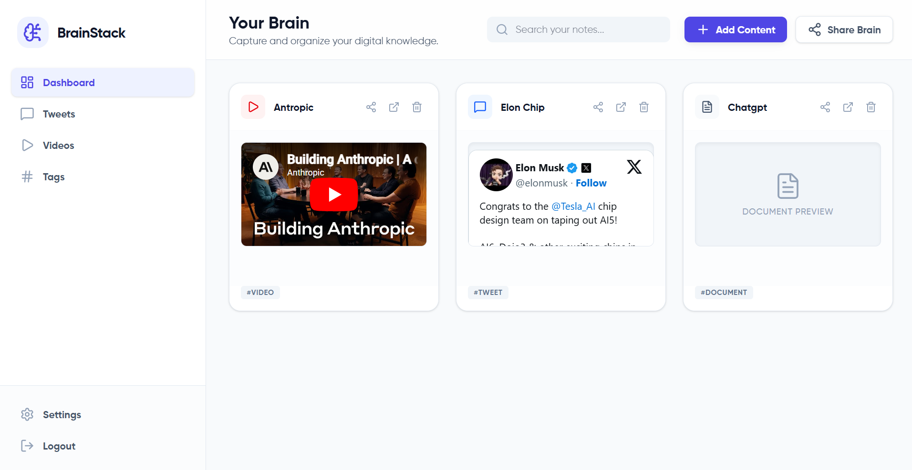

# 🧠 BrainStack UI

[](https://vitejs.dev/)
[](https://reactjs.org/)
[](https://www.typescriptlang.org/)
[](https://tailwindcss.com/)
[](https://vercel.com/)

**BrainStack** is your personal "Second Brain" application designed to organize digital chaos. It helps you capture, categorize, and recall everything you find interesting online—from tweets and YouTube videos to articles and personal notes.

<p align="center">
  
</p>

---

## ✨ Key Features

- 🚀 **Instant Capture**: Save tweets, videos, and articles in a single click with content-aware cards.
- 📂 **Smart Categorization**: Organizes your content into intuitive categories like Videos, Tweets, and Documents.
- 🔗 **Quick Sharing**: Generate unique, shareable links to your curated "Stacks" to collaborate or showcase your knowledge.
- 🔍 **Lightning Search**: Find exactly what you're looking for with a fast, real-time search interface.
- 🛡️ **Secure & Private**: Built with modern security practices to keep your digital library safe.
- 🎨 **Premium UI/UX**: A clean, modern interface featuring glassmorphism, smooth transitions, and a responsive layout.

---

## 🛠️ Tech Stack

- **Frontend Framework**: [React 19](https://react.dev/)
- **Build Tool**: [Vite 8](https://vitejs.dev/)
- **Language**: [TypeScript](https://www.typescriptlang.org/)
- **Styling**: [Tailwind CSS v4](https://tailwindcss.com/)
- **Icons**: [Lucide React](https://lucide.dev/)
- **Navigation**: [React Router 7](https://reactrouter.com/)
- **API Client**: [Axios](https://axios-http.com/)
- **Deployment**: Optimized for [Vercel](https://vercel.com/)

---

## 🚀 Getting Started

### Prerequisites

- [Node.js](https://nodejs.org/) (Latest LTS)
- [npm](https://www.npmjs.com/) or [yarn](https://yarnpkg.com/)

### Installation

1. **Clone the repository**:

   ```bash
   git clone https://github.com/devansh-chouhan/BrainStack-UI.git
   cd BrainStack-UI
   ```

2. **Install dependencies**:

   ```bash
   npm install
   ```

3. **Set up Environment Variables**:
   Create a `.env` file (or update `src/config.tsx`) with your backend URL:

   ```env
   VITE_BACKEND_URL=your_backend_api_url
   ```

4. **Start the development server**:

   ```bash
   npm run dev
   ```

5. **Build for production**:
   ```bash
   npm run build
   ```

---

## 📂 Project Structure

```text
brainstack-ui/
├── public/           # Static assets
├── src/
│   ├── components/    # Reusable UI components (Button, Card, Sidebar, etc.)
│   ├── hooks/         # Custom React hooks (useContent, etc.)
│   ├── pages/         # Page components (Home, Dashboard, SharedBrain)
│   ├── icons/         # Custom SVG/Lucide icon wrappers
│   ├── App.tsx        # Main application routing
│   ├── main.tsx       # Entry point
│   └── index.css      # Tailwind & Global styles
├── tailwind.config.js # Tailwind configuration
├── vite.config.ts    # Vite configuration
└── vercel.json       # Vercel deployment configuration
```

---

## 🎨 Design System

BrainStack uses a custom design system built on top of Tailwind CSS, featuring:

- **HSL-based Color Palettes**: Consistent branding with `primary`, `secondary`, and `accent` colors.
- **Premium Shadows**: Multi-layered shadows for depth.
- **Smooth Animations**: Tailored CSS transitions for modals and hover states.
- **Responsive Layouts**: Fully optimized for Desktop, Tablet, and Mobile.

---

## 🤝 Contributing

Contributions are welcome! Please feel free to submit a Pull Request.

1. Fork the Project
2. Create your Feature Branch (`git checkout -b feature/AmazingFeature`)
3. Commit your Changes (`git commit -m 'Add some AmazingFeature'`)
4. Push to the Branch (`git checkout origin feature/AmazingFeature`)
5. Open a Pull Request

---

## 📄 License

This project is licensed under the MIT License - see the [LICENSE](LICENSE) file for details.

---

<p align="center">Built with ❤️ by Devansh Chouhan</p>
